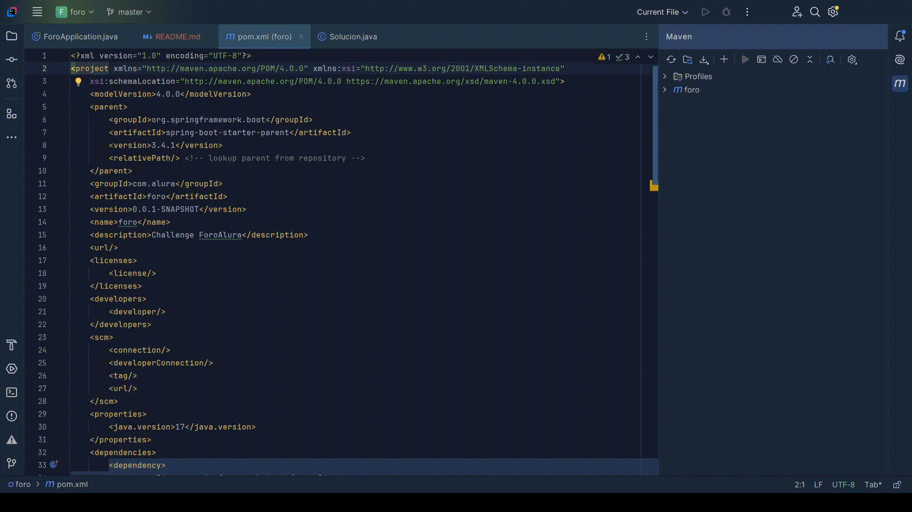
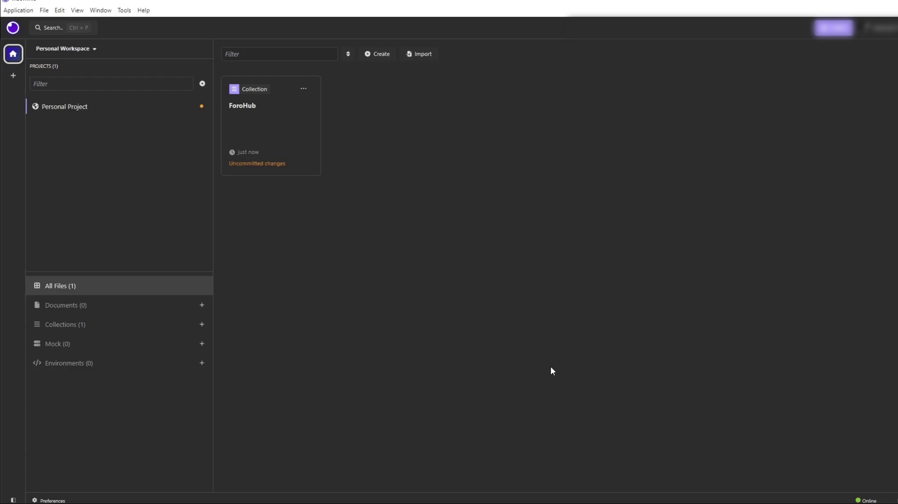
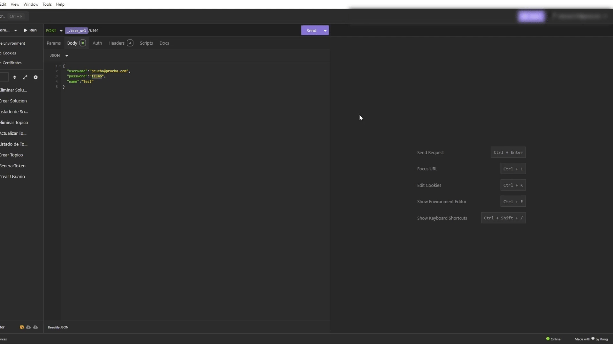
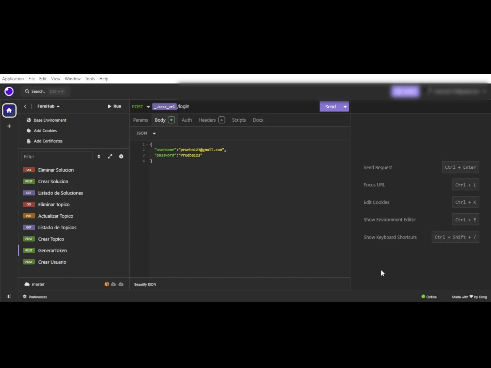
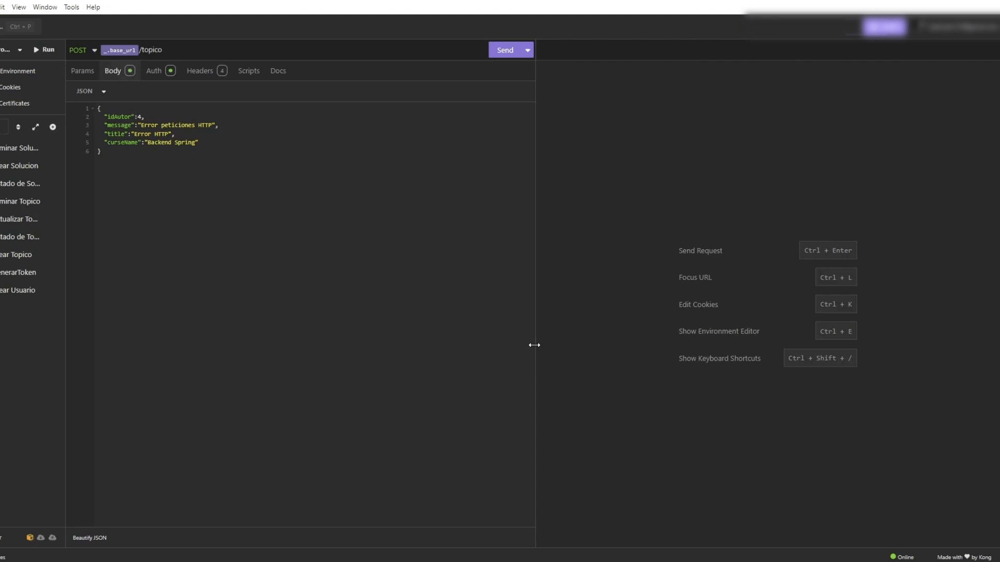
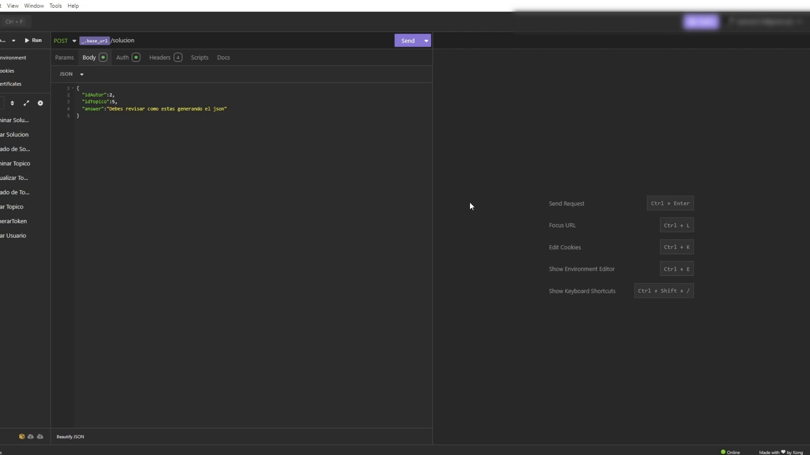

# Challenge ForoHub Alura

### ForoHub creado utilizando tecnologías como lo son Java17 y Spring Boot para el reto de Alura Latam


Para clonar el proyecto se realiza los siguientes comandos:

```
mkdir ForoHub
cd ForoHub 
git clone https://github.com/TheBarrelExploit/ForoHubAlura.git
cd ForoHubAlura
```
# :hammer_and_wrench: Lenguajes,tecnologías e IDE utilizados:
<div> 
 &nbsp;
 &nbsp;
 &nbsp;
 &nbsp;
 
</div>

# Instalación de dependencias:
Se utiliza el gestor de maven para realizar la descarga, para esto se utiliza el IDE de intellij para abrir el proyecto y realizar el procedimiento.

# Ejecutar proyecto
Con el proposito de ejecutar el programa, se debe ir al archivo denominado ForoApplication, donde si se ejecuta por primera vez
se realiza la creación de las tablas en la base de datos y luego de eso se despliega gracias a tomcat en el puerto 8080 de manera 
local.
# Variables de entorno
Para este proyecto se requiere tener un total de 4 variables, con los siguientes nombres:
- `DB_HOST_MYSQL`: ip:puerto.
- `DB_NAME_MYSQL`: nombredelesquema.
- `DB_USER_MYSQL`: usuario.
- `DB_PASSWORD`: contraseña.

# 🔨 Funcionalidades 
- `Funcionalidad 1`: Creación de usuarios 
- `Funcionalidad 2`: Actualización de usuarios
- `Funcionalidad 3`: Eliminación de usuarios
- `Funcionalidad 4`: Creación de tokenJWT
- `Funcionalidad 5`: Creación de Topicos
- `Funcionalidad 6`: Eliminación de Topicos
- `Funcionalidad 7`: Actualización de topicos
- `Funcionalidad 8`: Listado de topicos
- `Funcionalidad 9`: Creación de Soluciones
- `Funcionalidad 10`: Eliminación de Soluciones
- `Funcionalidad 11`: Actualización de Soluciones
- `Funcionalidad 12`: Listado de Soluciones
# Peticiones Http de insomia 
Dentro de la carpeta del proyecto se encuentra el archivo "Insomnia_2025-01-21.json", donde 
se encuentra las request utilizadas para la prueba del proyecto.



# Demo ⚙️
- Crear Usuario

- Crear JWT

- Crear Topic

- Crear Solución


# Licencia 📄
Este proyecto está bajo la Licencia MIT - mira el archivo [LICENSE](LICENSE) para mas detalles para detalles


