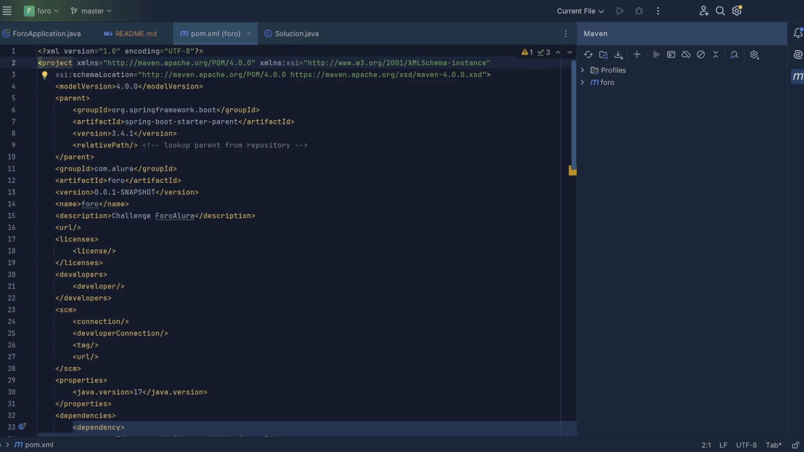

# Challenge ForoHub Alura

### ForoHub creado utilizando tecnologías como lo son Java17 y Spring Boot para el reto de Alura Latam


Para clonar el proyecto se realiza los siguientes comandos:

```
mkdir ForoHub
cd ForoHub 
git clone https://github.com/TheBarrelExploit/ForoHubAlura.git
cd ForoHubAlura
```
# Instalación de dependencias:
Se utiliza el gestor de maven para realizar la descarga, para esto se utiliza el IDE de intellij para abrir el proyecto y realizar el procedimiento.



# :hammer_and_wrench: Lenguajes,tecnologías e IDE utilizados:
<div> 
 &nbsp;
 &nbsp;
 &nbsp;
 &nbsp;
 
</div>


# 🔨 Funcionalidades 
- `Funcionalidad 1`: Creación de usuarios 
- `Funcionalidad 2`: Actualización de usuarios
- `Funcionalidad 3`: Eliminación de usuarios
- `Funcionalidad 4`: Creación de tokenJWT
- `Funcionalidad 5`: Creación de Topicos
- `Funcionalidad 6`: Eliminación de Topicos
- `Funcionalidad 7`: Actualización de topicos
- `Funcionalidad 8`: Listado de topicos
- `Funcionalidad 9`: Creación de Soluciones
- `Funcionalidad 10`: Eliminación de Soluciones
- `Funcionalidad 11`: Actualización de Soluciones
- `Funcionalidad 12`: Listado de Soluciones
# Peticiones Http de insomia 
Dentro de la carpeta del proyecto se encuentra el archivo "Insomnia_2025-01-21.json", donde 
se encuentra las request utilizadas para la prueba del proyecto.


# Demo ⚙️
- Crear Usuario

- Crear JWT

- Crear Topic

- Crear Solución


# Licencia 📄 
Este proyecto está bajo la Licencia MIT - mira el archivo [LICENSE](LICENSE) para mas detalles para detalles


